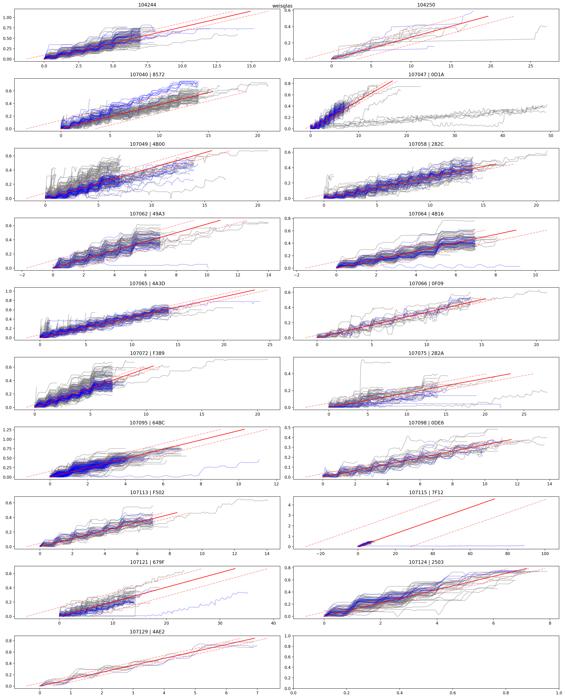

# Open Data Hack SG 2023: Füllverhalten von Glas-Sammelstellen

- Untersuchung der Fülldaten
    - [Sensor-Datensets](https://daten.stadt.sg.ch/explore/?q=F%C3%BCllstandsensoren&disjunctive.modified&disjunctive.publisher&disjunctive.theme&disjunctive.keyword&sort=modified)
- Bereinigung der Fülldaten
    - Ausreisser entfernen
    - Glätten
- Splitten der Daten in Perioden zwischen Entleerungen
- Trainieren eines linearen Modells mit linearer Regression

## Aufbau des Repos

- Sensordaten und lineares Modell
    - `src/prepare_and_split_data.py`: Script um Sensordaten zu Bereinigen
    - `src/prepare_and_split_data.ipynb`: Experimenteller Code um Sensordaten bereinigen
    - `src/calculate_slope_per_station.py/.ipynb`: Füllgeschwindigkeiten von bereinigten Sensordaten berechnen.
    - `src/calc_prediction_accuracy.py`: Berechnen des Standard Errors mit Testdaten.
- Zusammenhang von Füllgeschwindigkeit und Bevölkerungsdichte
    - `src/get_population_per_collection_point.py`: Zuweisen von Quartier/Bevölkerung und Sammelstelle
    - `src/calculate_slope_with_population.py`: Untersuchung von Zusammenhang

## Resultate

Diagramme und Grafiken in `img/` Ordner.
Füllgeschwindigkeiten und weitere statistische Werte in `results/*_slopes.csv`.

## Infos

- So, 9:00: Submission
- Dribdat Project <https://hack.opendata.ch/event/66>
- [3min Pitch Video](https://vimeo.com/890737549)

## Team

- Dominik Gschwind, @N3xed
- Cedric Christen, @cedi4155476
- Roman Weiss, @romanweiss123
- Roméo Bornand